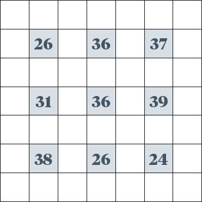

# Gridlock puzzle (The Actuary magazine Puzzle 500)

From [the puzzle pages of The Actuary April 2012](http://www.theactuary.com/puzzles-and-games/2012/the-actuary-puzzles-april-2012/), I attempt to solve the following, making use of R:

> Below is a grid containing nine shaded squares, and around each shaded
> square are eight white squares. However, each white square should
> contain an integer from 1 to 7. Once filled in, the eight numbers surrounding
> each shaded square should sum to the number in the shaded square. In
> addition, no row or column can contain a duplicate number used within a
> white square. Can you complete the grid?

