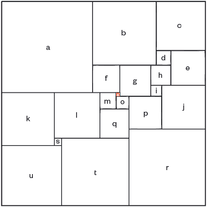

# The Actuary Puzzle 508 - Square numbers

From [the puzzle pages of The Actuary June 2012](http://www.theactuary.com/puzzles-and-games/2012/the-actuary-puzzles-june-2012/), I attempt to solve the following, making use of R:

> This square contains exactly 21 smaller squares. Each of these smaller
> squares has sides of integer length, with no two smaller squares having
> sides of the same length. Can you find a solution for the size of the 21 smaller
> squares? (Note, the 21st square, n, is between squares f, g, m and o).



The approach I decided to take was to calculate a few relationships and work from there to attempt to find working solutions, instead of working out all necessary equations and completely solving. Although there can be probably be an exhaustive set of calculations leading to some form of order of size (and solution), any assumptions on size are based on size differences guaranteed by adjacent squares and following lines directly, not from comparing printed sizes, so this approach may be missing out on easily excluding some more impossible values this way.

## Initial rules
Looking at the square and coming up with a few rules hoping to be exhaustive enough, where letter $x$ here is the value of the length of side on square $x$:

* Values are integers.
* Values are unique.
* $o > n$
* $m = n + o$
* $q = m + o$
* $l = m + q$
* $s = 0.25 * q \Rightarrow 4 | q$, as all values are integers. 
    * Derivation: $t + s = l + q \Rightarrow (u + s) + s = l + q \Rightarrow u + 2s = l + q$
	  * $\Rightarrow (k + s) + 2s = l + q \Rightarrow k + 3s = l + q$
      * $\Rightarrow (l + s) + 3s = l + q \Rightarrow l + 4s = l + q$
	  * $\Rightarrow 4s = q$
* $4 | q = m + o = (n + o) + o = n + 2o$, so have that $4 | n + 2o$.
  * $2 | 4$ and $2 | 2o \Rightarrow 2 | n$, so $n$ is even.
* $k = l + s$
* $u = k + s$
* $t = u + s$
* $l - n > p > o$
* $r = l + t - n -p$
* $j = r - p$
* $i = j - p$
* $g = q + p - i - n - m$
* $f = g - n$
* $h = g - i$
* $e = i + j - h$
* $d = e - h$
* $c = d + e$
* $b = c + d$
* $a = b + f$

The set of numbers are also contrained by the fact that the total length of each side of the large square is consistent (will check this in three ways):
* $a + b + c = u + t + r$
* $b + c = k + u$
* $b + t = k + e + j$

Also, the total area of the small squares should sum the total area of the large square:
* $(a + b + c)^2 = a^2 + b^2 + c^2 + ... + s^2 + t^2 + u^2$

## Calculations

Under these assumptions there are very few lengths which aren't defined by the lengths of values already determined, so setting up nested loops for searching for working solutions shouldn't be too computationally intensive. 

First decide on maximum values to take across our loops.
```{r set_max_values, eval = TRUE}
max_nn <- 10
max_oo <- 50
```

Now set up the set of possible values for our first guess (in this case, square $n$, which is even)
```{r set_possible_n_values, eval = TRUE}
possible_nn <- 2 * 1:(max_nn / 2)
```

Instead of stopping the loop at the first solution, will save all of the combinations in a list outside the loop, to see if there are multiple solutions.
```{r set_empty_solutions, eval = TRUE}
possible_solutions <- list()
i <- 1
```

Now create and check possible values under the rules above, looping across possible values for those not defined strictly by linear sums and moving onto the next possibility when it produces an incorrect combination of values:

```{r possible_value_loop, eval = TRUE}
for(nn in possible_nn) {
  possible_oo <- (nn + 1):max_oo  # includes that o > n
  for(oo in possible_oo) {
    mm <- nn + oo
	qq <- mm + oo
	if((qq %% 4) != 0) next
	ll <- mm + qq
	if(any(duplicated(c(nn, oo, mm, qq, ll)))) next
	ss <- qq / 4
	kk <- ll + ss
	uu <- kk + ss
	tt <- uu + ss
    if(any(duplicated(c(nn, oo, mm, qq, ll, ss, kk, uu, tt)))) next
	possible_p <- (oo + 1):(ll - nn - 1)
	possible_p <- possible_p[!{
	  possible_p %in% c(nn, oo, mm, qq, ll, ss, kk, uu, tt)
	}] # filter out values already used, as all numbers must be unique
	if(length(possible_p) == 0) next
	for(pp in possible_p) {
	  rr <- ll + tt - nn - pp
	  jj <- rr - pp
	  ii <- jj - pp
	  gg <- qq + pp - ii - nn - mm
	  ff <- gg - nn
	  hh <- gg - ii
	  ee <- ii + jj - hh
	  dd <- ee - hh
	  cc <- dd + ee
	  bb <- cc + dd
	  aa <- bb + ff
	  
      all_values <- c(
	    a = aa, b = bb, c = cc, d = dd, e = ee, f = ff, g = gg, h = hh, i = ii,
		j = jj, k = kk, l = ll, m = mm, n = nn, o = oo, p = pp, q = qq, r = rr,
		s = ss, t = tt, u = uu)
	    
	  if(any(duplicated(all_values))) next
	  if(aa + bb + cc != uu + tt + rr) next
	  if(bb + cc != kk + uu) next
	  if(bb + tt != kk + ee + jj) next

	  if((aa + bb + cc)^2 != sum(all_values^2)) next
	  
	  # if execution reaches here, numbers fit criteria:
	  possible_solutions[[i]] <- all_values
	  i <- i + 1
	}
  }
}
```

This produces the following (potential) solutions to the puzzle:

```{r, eval = TRUE, echo = FALSE}
possible_solutions
```

As you can see, they are seem to be multiples of the first solution (when $a = 50$, $b = 35$, etc) suggesting a unique solution up to scalar multiples, but these still need to be confirmed. To do this will now attempt to plot the square with layout from the original puzzle, values from the first produced solution.

```{r plot_setup}
library(ggplot2)
values <- as.list(possible_solutions[[1]]) # use first solution in the list
```

To set up the plot, need to manually create table of values of corner locations for each square. I used the image of the puzzle to create these points based on lengths of all squares in a given solution.

```{r square_df, eval = TRUE}
squares <- list()

squares <- with(values, {
  sq <- list()
  sq$u <- c(x1 = 0, y1 = 0, x2 = u, y2 = u)
  sq$u <- c(x1 = 0, y1 = 0, x2 = u, y2 = u)
  sq$t <- c(x1 = u, y1 = 0, x2 = u + t, y2 = t)
  sq$r <- c(x1 = u + t,  y1 = 0, x2 = u + t + r,  y2 = r)
  sq$k <- c(x1 = 0, y1 = u, x2 = k, y2 = u + k)
  sq$s <- c(x1 = k, y1 = u, x2 = k + s, y2 = u + s)  
  sq$l <- c(x1 = k, y1 = u + s, x2 = k + l, y2 = u + s + l)
  sq$q <- c(x1 = k + l, y1 = t, x2 = k + l + q, y2 = t + q)
  sq$m <- c(x1 = k + l, y1 = t + q, x2 = k + l + m, y2 = t + q + m)
  sq$o <- c(x1 = k + l + m, y1 = t + q, x2 = k + l + m + o, y2 = t + q + o)
  sq$n <- c(x1 = k + l + m, y1 = t + q + o, x2 = k + l + m + n, y2 = t + q + o + n)
  sq$p <- c(x1 = k + l + q, y1 = r, x2 = k + l + q + p, y2 = r + p)
  sq$j <- c(x1 = k + l + q + p, y1 = r, x2 = k + l + q + p + j, y2 = r + j)
  sq$i <- c(x1 = a + f + g, y1 = r + p, x2 = a + f + g + i, y2 = r + i)
  sq$a <- c(x1 = 0, y1 = k + u, x2 = a, y2 = k + u + a)
  sq$b <- c(x1 = a, y1 = t + q + m + f, x2 = a + b, y2 = t + q + m + f + b)
  sq$c <- c(x1 = a + b, y1 = r + j + e, x2 = a + b + c, y2 = r + j + e + c)
  sq$d <- c(x1 = a + b, y1 = r + j + h, x2 = a + b + d, y2 = r + j + h + d)
  sq$e <- c(x1 = a + b + d, y1 = r + j, x2 = a + b + d + e, y2 = r + j + e)
  sq$f <- c(x1 = a, y1 = t + l, x2 = a + f, y2 = t + l + f)
  sq$g <- c(x1 = a + f, y1 = t + q + o, x2 = a + f + g, y2 = t + q + o + g)
  sq$h <- c(x1 = a + f + g, y1 = r + j, x2 = a + f + g + h, y2 = r + j + h)
  sq$i <- c(x1 = a + f + g, y1 = r + p, x2 = a + f + g + i, y2 = r + p + i)
  return(sq)
})

squares_df <- data.frame(do.call("rbind", squares), square = names(squares))
squares_df
```

Now plot this to see if it matches the puzzle, using ggplot2 and the geom "geom_rect" for plotting the rectangles. To achieve random colouring, first rearranged the levels of the factor "square":

```{r plot_squares, eval = TRUE, tidy = FALSE}
set.seed(1)
ggplot(square_positions_df) +  
  scale_x_continuous(name="x") + 
  scale_y_continuous(name="y") +
  geom_rect(aes(
      xmin = x1, 
	  xmax = x2, 
	  ymin = y1, 
	  ymax = y2, 
	  fill = factor(square, levels = sample(levels(square)))), 
	colour = "black") + 
  geom_text(aes(
    x = x1 + (x2 - x1) / 2, 
	y = y1 + (y2 - y1) / 2, 
	label = square)) +
  opts(legend.position = "none", title = "21 squares")
```

# Final solution!
As you can see, it has produced a correct solution:

```{r final_solution}
  unlist(values)
``` 

I'm certain that further algebra playing, coming up with more equations perhaps from the picture, this result can be derived without these loops but it was definitely a fun exercise producing a solution this way.
