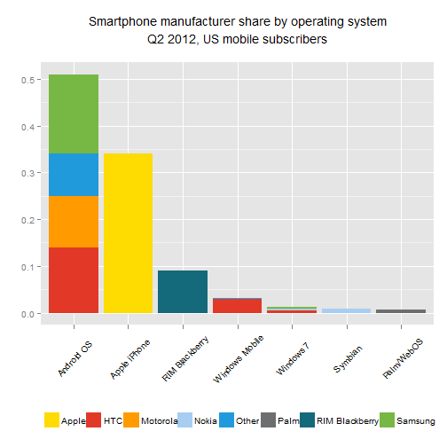
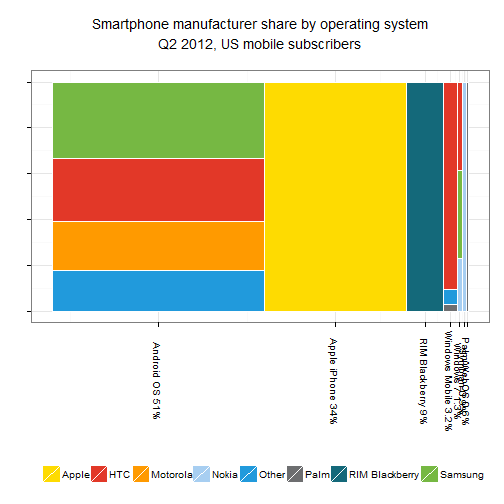
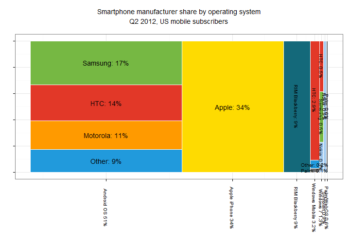

# Smartphone operating system share mosaic plot
The increasing dominance of smartphones across the market is a very common topic in technology and news sites, with analysis of operating system share and phone types often shown in the media.

Stumbling across [this article](http://blog.nielsen.com/nielsenwire/?p=32494) on Nielsen Wire, I couldn't help but notice the massively disproportionate visualisation showing smartphone manufacturer share: 


This use of a mosaic plot may seem to be a good choice due to the ability to easily see operating system market share and within each operating system see the split by manufacturers, but this only holds in practice if areas are weighted equally across the plot. The plot here, however, seems to place nearly equal area to Apple's 34% compared to RIM's 9%, as well as many other issues such as HTC apparently having as much market share across HTC Windows phones (which 3.4%) as on Android (in fact this is much larger at 14%).

Since we wish to see the split of manufacturers across OSes,and still demonstrate all of the main operating systems avaiable, a stacked bar chart would do a better job. Let's set this up in R:

To mimic the style of the article, I first set up a data frame and custom colour palette:


```r
phone_manufacturer_split <- data.frame(
  operating_system = c(
    rep("Android OS", 4), 
	"Apple iPhone", 
	"RIM Blackberry", 
	rep("Windows Mobile", 3), 
	rep("Windows 7", 3),
	"Symbian",
	"Palm/WebOS"),
  manufacturer = c(
    "Samsung", "HTC", "Motorola", "Other",
	"Apple",
	"RIM Blackberry",
	"HTC", "Palm", "Other",
	"Samsung", "Nokia", "HTC",
	"Nokia",
	"Palm"),
  share = c(
    0.17, 0.14, 0.11, 0.09,
	0.34,
	0.09,
	0.029, 0.001, 0.002,
	0.005, 0.003, 0.005,
	0.009, 0.006
  )
)

custom_colours <- c(
  Samsung          = rgb(118, 184, 67, maxColorValue = 255),
  HTC              = rgb(226, 56, 40, maxColorValue = 255),
  Motorola         = rgb(255, 154, 0, maxColorValue = 255),
  Other            = rgb(33, 154, 220, maxColorValue = 255),
  Apple            = rgb(254, 219, 1, maxColorValue = 255),
  `RIM Blackberry` = rgb(20, 105, 122, maxColorValue = 255),
  Palm             = rgb(109, 110, 112, maxColorValue = 255),
  Nokia            = rgb(167, 206, 241, maxColorValue = 255))
```


I will also reproduce the mosaic plot with correct areas, although due to the large size difference of each element not all labels will be easy to format. Setting up necessary data such as midpoints for the elements, and ordering factors so that the plots will be ordered by total operating system market share:


```r
combined <- aggregate(share ~ operating_system , phone_manufacturer_split, sum)
names(combined)[which(names(combined) == "share")] <- "os_share"

combined <- combined[order(combined$os_share, decreasing = TRUE), ]
combined <- within(combined, cumsum <- cumsum(os_share))
combined <- within(combined, os_mid <- cumsum - 0.5 * os_share)

phone_manufacturer_split <- merge(
  phone_manufacturer_split, 
  combined[c("operating_system", "os_share", "os_mid")], 
  by = "operating_system")

phone_manufacturer_split <- within(
  phone_manufacturer_split,
  pct_os_split <- share / os_share)

os_manufacturer_mid <- lapply(
  unique(phone_manufacturer_split$operating_system), 
  FUN = function(the_operating_system) {
    os_subset <- subset(
	  phone_manufacturer_split, 
	  operating_system == the_operating_system)
    os_subset <- os_subset[order(os_subset$pct_os_split), ]
    os_subset <- within(
	  os_subset, 
	  os_manufacturer_mid <- {
	    cumsum(pct_os_split) - 0.5 * 	pct_os_split}
	)
    return(os_subset)
  })

phone_manufacturer_split <- do.call("rbind", os_manufacturer_mid)
phone_manufacturer_split <- within(
  phone_manufacturer_split, 
  operating_system <- factor(
    operating_system, 
	levels = combined$operating_system[order(combined$os_share, decreasing = TRUE)]))

phone_manufacturer_split
```

```
##    operating_system   manufacturer share os_share os_mid pct_os_split
## 4        Android OS          Other 0.090    0.510 0.2550      0.17647
## 3        Android OS       Motorola 0.110    0.510 0.2550      0.21569
## 2        Android OS            HTC 0.140    0.510 0.2550      0.27451
## 1        Android OS        Samsung 0.170    0.510 0.2550      0.33333
## 5      Apple iPhone          Apple 0.340    0.340 0.6800      1.00000
## 6        Palm/WebOS           Palm 0.006    0.006 0.9970      1.00000
## 7    RIM Blackberry RIM Blackberry 0.090    0.090 0.8950      1.00000
## 8           Symbian          Nokia 0.009    0.009 0.9895      1.00000
## 10        Windows 7          Nokia 0.003    0.013 0.9785      0.23077
## 9         Windows 7        Samsung 0.005    0.013 0.9785      0.38462
## 11        Windows 7            HTC 0.005    0.013 0.9785      0.38462
## 13   Windows Mobile           Palm 0.001    0.032 0.9560      0.03125
## 14   Windows Mobile          Other 0.002    0.032 0.9560      0.06250
## 12   Windows Mobile            HTC 0.029    0.032 0.9560      0.90625
##    os_manufacturer_mid
## 4              0.08824
## 3              0.28431
## 2              0.52941
## 1              0.83333
## 5              0.50000
## 6              0.50000
## 7              0.50000
## 8              0.50000
## 10             0.11538
## 9              0.42308
## 11             0.80769
## 13             0.01562
## 14             0.06250
## 12             0.54688
```


To set up the plots, will use ggplot2:

```r
library(ggplot2)
```


Now, to set up the stacked chart:

```r
stacked_bar <- ggplot(phone_manufacturer_split, aes(x = operating_system, 
    y = share, fill = manufacturer)) + geom_bar(position = "stack") + opts(title = "Smartphone manufacturer share by operating system\nQ2 2012, US mobile subscribers\n", 
    legend.position = "bottom") + xlab("") + ylab("") + labs(fill = "") + opts(axis.text.x = theme_text(angle = 45)) + 
    scale_fill_manual(values = custom_colours)
```


```r
stacked_bar
```

 


This clearly demonstrates a lot more accurately the data as it exists, including showing more accurately the market dominance of Android OS and Apple iPhone, as well as emphasising the small share of the others, mainly because the dimensions used are now actually correctly mapped to values!

Now, to attempt to mimic the original plot in ggplot will produce many difficulties in formatting, as there are massive overlaps if there are to be labels, so first will produce the mosaic plot without labels:


```r
the_plot <- ggplot(
    data = phone_manufacturer_split, 
    aes(
      x = os_mid, 
      y = os_manufacturer_mid, 
      fill = manufacturer)) + 
  geom_tile(
    colour = "white", 
	aes(
	  height = pct_os_split, 
	  width = os_share)) +
  theme_bw() +
  opts(
    title = "Smartphone manufacturer share by operating system\nQ2 2012, US mobile subscribers\n") +
  opts(axis.text.x = theme_text(angle = -90)) +
  opts(axis.text.y = theme_blank()) +
  xlab("") + 
  ylab("") + 
  labs(fill = "") +
  scale_x_continuous(
    breaks = combined$os_mid, 
	label = paste(
	  combined$operating_system, 
	  " ", 
	  100 * combined$os_share, 
	  "%", 
	  sep = "")) +
  scale_fill_manual(values = custom_colours) +
  opts(legend.position = "bottom")
```


This gives the following plot, which again, as with the stacked bar chart, correctly has area mapped to market share:

```r
the_plot
```

 


The very thin bars for the smaller market share percentages are now too small to perceive and at this resolution are not represented correctly anyway, but this does suggest why the original chart strayed from accurate sizes anyway, so as to make the boxes at least visible, but at the cost of being a correctly informative visualisation of the underlying data. 

Quickly playing with some ggplot settings to attempt to now add the labels, as I haven't the time to fully replicate the design and improve the graphic it'll not look as pretty but will more importantly still be true to the data:


```r
the_plot_formatted <- the_plot + 
  geom_text(
    data = subset(
	  phone_manufacturer_split, 
	  os_share > 0.3),
	aes(label = paste(manufacturer, ": ", 100 * share, "%", sep = ""), angle = 0)) +
  geom_text(
    data = subset(
	  phone_manufacturer_split, 
	  {operating_system == "Windows Mobile"}&{
	   manufacturer %in% c("Other", "Palm")}
	  ),
    aes(
	  label = paste(manufacturer, ": ", 100 * share, "%", sep = ""), 
	  size = 1, 
	  angle = 0)) +
  geom_text(
    data = subset(
	  phone_manufacturer_split, 
	  {os_share < 0.3}&!({
	   operating_system == "Windows Mobile"}&{
	   manufacturer %in% c("Other", "Palm")})
      ),
    aes(
	  label = paste(manufacturer, ": ", 100 * share, "%", sep = ""), 
	  size = 1, 
	  angle = -90)) +
  opts(legend.position = "off") + 
  guides(size = FALSE)
```


 


This plot would still require some finishing touches to improve the formatting but I'll leave it as it is. I've also outputted a [much larger version of the mosaic plot](http://i.imgur.com/8wgAk.png) to properly demonstrate the plot as it should be:
[http://i.imgur.com/8wgAk.png](http://i.imgur.com/8wgAk.png)

Whilst creating the data frame with values from the Nielsen published graphic, I also couldn't help but notice that the numbers didn't match up with those in the article itself, e.g. Android OS at 51.8% in the article, 51% in the graphic, and RIM only at 8.1% in the article but rounded *up* to 9% for the graphic! 
